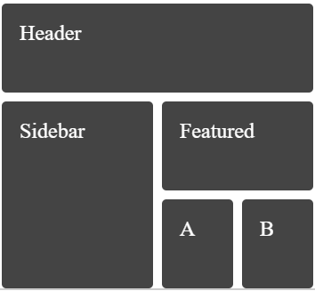

# GOLDEN RACE FRONTEND TEST

# INSTRUCTIONS

This is an Angular Workspace with 4 applications, each of them is an exercise.

Complete all the exercises and upload the project to a Git server and give us access or send us the project zipped.

Install the dependencies as usual and run the apps with Angular CLI. For example:

`npx ng serve exercise1`

## REQUIREMENTS

- All the components, pipes, and services must have unit tests.
- CSS Frameworks or component libraries are not allowed.
- External dependencies like NPM packages, fonts, styles or scripts from CDNs are not allowed.
- The application must not throw unhandled errors on the console.
- All the code, documentation or UI must be written in English.
- The linter must work by running `npm run lint`.
- The build must work by running `npm run build`
- All the tests must pass by running `npm run test`

## THINGS WE VALUE

- Strongly typed code
- Documentation and well commented code
- The fewer external dependencies the better
- Angular forms and validators usage
- Prettier usage
- Advanced RxJS usage
- SCSS Variables or CSS Custom Properties usage
- CSS Flex or Grid usage
- Git usage

## THE TEST

### EXERCISE 1

- Create a reactive form with two fields "product name" and "price"
- The price must be a number greater than 5 and less than 20
- The product name must be a string longer than 5 characters and smaller than 20
- After submitting the form, if the form is valid show a success message
- After submitting the form, if the form is invalid show the validation errors
- Hide the messages after the form reset
- Implement unit tests for the component

### EXERCISE 2

- Create a new module with a component called "lazy"
- Use routing to lazy load the module and show the component when the route is "/lazy"
- Create a new module with a component called "secure"
- Use routing to lazy load the module and show the component when the route is "/secure"
- Use routing to protect "/secure" route and never let the user load it
- Add two navigation links on the AppComponent to test both routes

### EXERCISE 3

- Modify the DataService getNumbers method to return a random integer number between 0 and 10, once per second
- Implement unit tests for the service
- Modify the AppComponent to show the last number emitted by the service and update it every time it changes
- Implement unit tests for the component

### EXERCISE 4

- Transform the AppComponent to match the attached image by using flex or grid
- No CSS frameworks or external dependencies are allowed
- The result must be responsive
- When the viewport width is bigger than 900px, center the content
- When the viewport width is smaller than 400px, print all the elements stacked in the following order: Header, Sidebar, Featured, A, B

